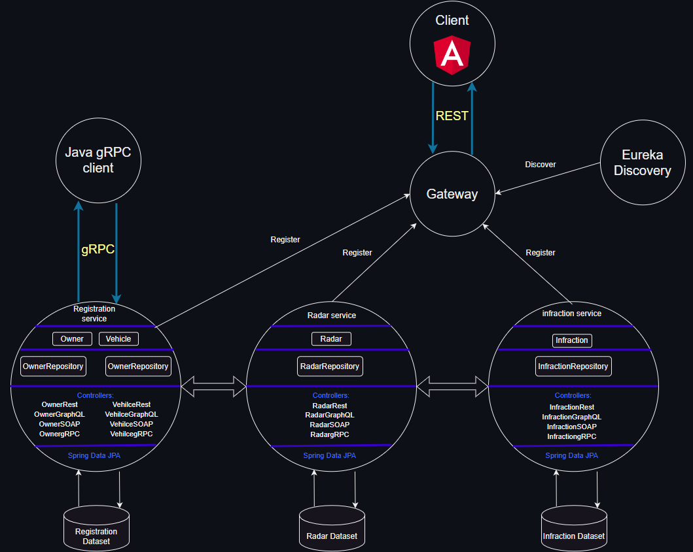
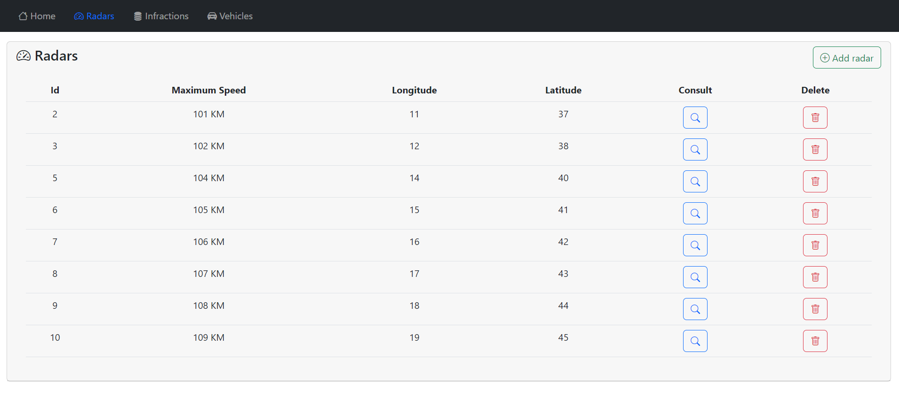
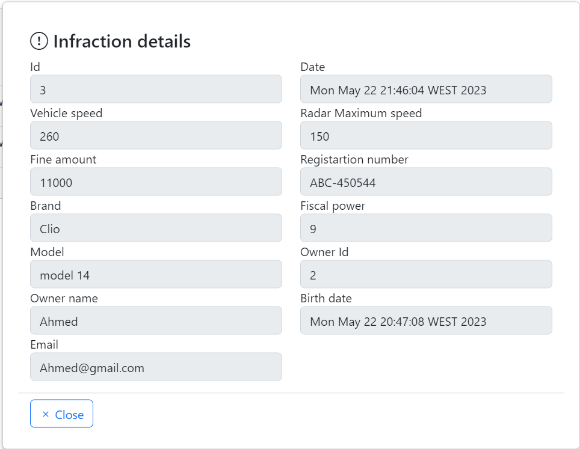

# 🍃 Distributed-systems
# Under development... 🚀

# 📝 Table of Contents
- [Architecture](#architecture)
- [Class Diagram](#class-diagram)
- [Registration service](#registration-service)
- [Infraction service](#infraction-service)
- [Radar service](#radar-service)
- [Radar gRPC client](#radar-grpc-client)
- [Eureka discovery and gateway](#eureka-discovery-and-gateway)
- [Angular client](#angular-client)
- [Security with Keycloak](#security-with-keycloak)
- [Docker](#docker)

# Architecture

# Class Diagram

# Angular client
- Table with all radars registered in the system

- Radar registration form

- Radar consultation

- Table with all infractions registered in the system

- Infraction registration form

- Infraction consultation

- Table with all vehicles registered in the system

- Vehicle registration form

